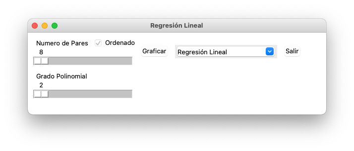

# Trabajo Parcial Algebra Lineal
## Objetivo
Pida el ingreso de n[8,12] y genere aleatoriamente npares ordenados. 
El programa debemostrar gráficamente la curva que se aproxime mejor linealmente a los n pares ordenados. 
El usuario debe seleccionar el tipo de curva: polinomial(de grado 𝑚≤6), exponencial o potencial.
## Requerimientos:
- python 3.7 o superior
- matplotlib
- numpy
## Instalacion 
Clonar la repo:

```bash
$ git clone https://github.com/renzodamgo/Trabajo_Parcial_Algebra_Lineal.git
```
Instalar matplot y numpy
```bash
$ pip install -r requirements.txt
```
## Interfaz
Se da al usuario un slider donde podra seleccional la cantidad de pares que desee entre [8,12]


Al generar pares se grafica su regresión lineal además de la regresion polinomial y la regresión exponencial.


